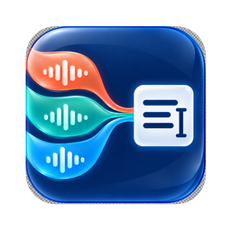

<p align="center">
  
</p>

<h1 align="center">TriScribe</h1>

<p align="center">
  <strong>说完，文字就在那里。</strong><br>
  免费、离线、为普通话 × 香港粤语 × English 打造的桌面语音输入工具。
</p>

<p align="center">
  
  
  
  
</p>

<p align="center">
  <a href="../../releases/latest/download/TriScribe_0.1.6_macOS_AppleSilicon.dmg"><strong>⬇️ 下载 macOS Apple 芯片版</strong></a>
  ·
  <a href="../../releases/latest">查看最新版本</a>
  ·
  <a href="docs/验收测试计划.md">验收测试计划</a>
</p>

## 为什么是 TriScribe？

很多语音输入工具要么依赖订阅，要么把录音上传云端，要么遇到粤语、中英夹杂和专业词就开始“自由发挥”。TriScribe 的目标很直接：让常用的三种语言在本机完成识别，然后把结果输入到你正在使用的任何应用。

### 三种语言，一套顺畅体验

| 使用场景    | 你说                                                                  | TriScribe 输入到光标处                                             |
| ----------- | --------------------------------------------------------------------- | ------------------------------------------------------------------ |
| ✍️ 日常办公 | “明天下午三点开会逗号请大家提前十分钟到场句号”                        | **明天下午三点开会，请大家提前十分钟到场。**                       |
| 💻 中英混输 | “这次 release 先把 onboarding 做完逗号其他 feature 放进 backlog 句号” | **这次 release 先把 onboarding 做完，其他 feature 放进 backlog。** |
| 💬 香港粤语 | “我哋听朝十点喺中环见逗号记得带埋份 proposal 句号”                    | **我哋聽朝十點喺中環見，記得帶埋份 proposal。**（繁體輸出）        |

## 主要功能

| 功能                | 你得到什么                                                   |
| ------------------- | ------------------------------------------------------------ |
| 🔒 本地离线识别     | 默认不上传录音和转写内容；严格离线隐私模式默认开启           |
| 🗣️ 三语自动识别     | 普通话、香港粤语、英语，以及常见中英夹杂                     |
| ✍️ 口述标点         | 说“逗号、句号、问号”等直接输入标点，可随时关闭               |
| 🀄 中文输出选择     | 简体／繁体自由切换，识别语言和输出字形互不绑定               |
| 💬 粤语表达选择     | 保留粤语口语，或使用实验性的本地书面化规则                   |
| ⚡ 全局快捷键       | 在聊天、文档、浏览器、代码编辑器等应用中直接听写             |
| 🫧 两种悬浮窗       | 默认 Minimal；也可选 Live，边说边显示本地预览文字            |
| 🧹 口吃与语气词整理 | 可移除常见重复、犹豫和填充词，保留真正想输入的内容           |
| 📚 自定义词汇       | 添加品牌、人名、地名和行业术语，支持“听错词→正确词”          |
| ☁️ 可选 AI 润色     | 兼容 DeepSeek 等 OpenAI 格式 API；严格离线模式下完全禁止调用 |

## 隐私边界

TriScribe 采用 offline-first 设计。默认设置下：

- 麦克风音频在本机录制和识别。
- 转写文本在本机完成标点、繁简转换、术语修正与语气词处理。
- 严格离线隐私模式会阻止任何云端 AI 后处理请求。
- 首次下载识别模型和主动检查更新时需要联网，但不会上传录音。
- 只有用户主动关闭严格离线模式、配置第三方 API 并启用 AI 后处理时，文字才会发送给所选服务商。

## 安装 macOS 测试版

1. 下载 [TriScribe v0.1.6 for Apple Silicon](../../releases/latest/download/TriScribe_0.1.6_macOS_AppleSilicon.dmg)。
2. 打开 DMG，把 `TriScribe.app` 拖入“应用程序”。
3. 首次启动时授予“麦克风”和“辅助功能”权限。
4. 如果 macOS 提示无法验证开发者，请在 Finder 中按住 Control 点击 TriScribe，选择“打开”；仍被阻止时，前往“系统设置 → 隐私与安全性”并选择“仍要打开”。
5. 在模型页下载并选择 SenseVoice，然后设置全局快捷键即可开始听写。

> [!NOTE]
> 覆盖安装新版本后，macOS 可能要求重新开启一次辅助功能权限。

### 系统要求

- Apple Silicon Mac（M1 或更新芯片）
- macOS 11 或更高版本
- 首次下载模型需要网络；之后可离线识别
- 建议预留至少 2GB 可用空间给应用、模型与录音历史

## 推荐设置

- 模型：`SenseVoice`
- 识别语言：`自动`
- Overlay：`Minimal`
- 严格离线隐私模式：`开启`
- 口述标点符号：`开启`
- 语音活动检测：`开启（Silero）`
- 输入结束自动补句号：按个人习惯选择

## 从源码运行

### 准备环境

- Rust stable
- Bun
- CMake
- macOS：Xcode Command Line Tools
- Windows：Visual Studio Build Tools

```bash
bun install
bun run tauri dev
```

构建安装包：

```bash
bun run tauri build
```

运行发布前检查：

```bash
bun run build
bun run lint
bun run check:translations
bun run check:model-languages
cd src-tauri && cargo test
```

更完整的平台构建说明见 [BUILD.md](BUILD.md)。Silero VAD 模型需要位于 `src-tauri/resources/models/silero_vad_v4.onnx`。

## 当前状态与路线图

- [x] 普通话／粤语／英语离线识别
- [x] 中英夹杂与自定义术语
- [x] 简体／繁体与粤语输出风格
- [x] 口述标点与标点冲突消解
- [x] Minimal／Live 悬浮窗
- [x] DeepSeek 等 OpenAI 兼容 API 后处理
- [x] macOS Apple Silicon 测试包
- [ ] 真实香港口音语料的公开基准报告

准确率不能只靠模型名称保证。正式场景请使用真实设备与真实口音语料，分别验证普通话 CER、粤语 MER、英语 WER、术语准确率和整体实时率；仓库提供了可复用的[验收测试计划](docs/验收测试计划.md)。

## 作者与致谢

TriScribe 由 **陈传扬（Chen Chuanyang）** 维护。

- Website: [chuanyangchen.ink](https://chuanyangchen.ink)
- Email: [chuanyangme@gmail.com](mailto:chuanyangme@gmail.com)

项目基于 [Handy](https://github.com/cjpais/Handy) 的 MIT 许可代码继续开发，并使用 SenseVoice、Silero VAD、OpenCC、Tauri、React、`transcribe-rs` 与 `transcribe-cpp` 等开源组件。详情见 [THIRD_PARTY_NOTICES.md](THIRD_PARTY_NOTICES.md)。

## License

[MIT](LICENSE) © CJ Pais、Chen Chuanyang 与贡献者。

---

<details>
<summary><strong>English summary</strong></summary>

TriScribe is a free, offline-first desktop dictation app for Mandarin, Hong Kong Cantonese, English, and everyday code-switching. It supports global hotkeys, spoken punctuation, Simplified/Traditional Chinese output, local filler-word cleanup, custom terminology, and optional OpenAI-compatible post-processing.

The current downloadable beta targets Apple Silicon Macs. Audio and transcripts stay local by default. See the privacy section above for the exact network boundary.

</details>
